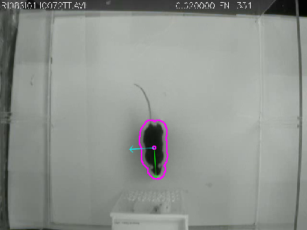
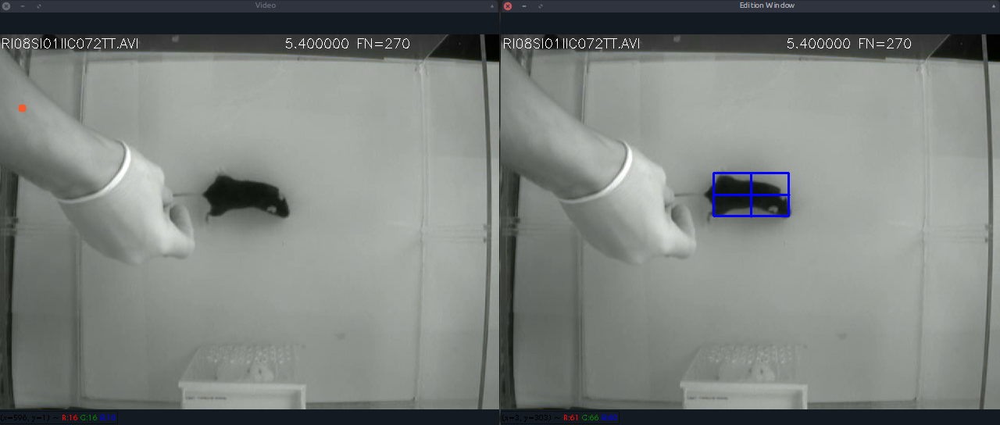
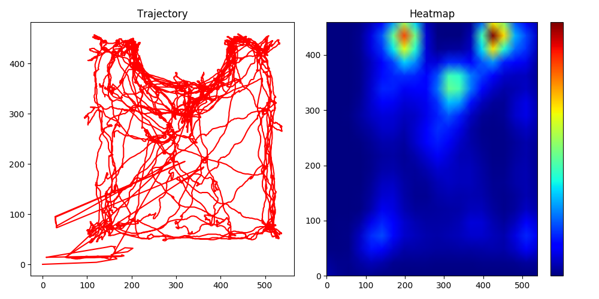

# Mice Tracking and Detection of Head Direction Using Principal Component Analysis (PCA)



This project **was developed and tested for Ubuntu 16.04 and 18.04.**

To use the provided tools, the first step is to clone this repository, which can be can be accomplished by:

```console
user@computer:~$ git clone https://github.com/vanluwin/proj-pca.git
```

## Requirements

### Python enviroment

This section is a guide to the installations of a python environment with the requirements of this repository.

First, install [Anaconda](https://www.anaconda.com/distribution/) or [Miniconda](https://docs.conda.io/en/latest/miniconda.html), both of them give you similar results, but the latter requires less disk space.

Now, create a python virtual environment and install the required packages following the commands. Substitute **<environment_name>** with a name for your environment

```console
user@computer:~$ conda create -n <enviroment_name> anaconda python=3
user@computer:~$ conda activate <enviroment_name>
(<enviroment_name>) user@computer:~$ conda install -c loopbio -c conda-forge -c pkgw-forge ffmpeg gtk2 numpy==1.16.3 opencv==3.4.3
```

### Background Image

For the tools here presented an image of the experiment scene without the animal present is necessary, in most cases, the first frame is this image. To extract the first frame using the [ffmpeg](https://ffmpeg.org/) tool use the following comand, substituting **video** with the path to the video file:

```console
user@computer:~$ ffmpeg -i video -ss 00:00:01 -vframes 1 bg.png
```

## Using the scripts

To use the provided scripts, make sure to activate your python environment, that can be accomplished by:

```console
user@computer:~$ conda activate <enviroment_name>
```

### [PCA Analyser](./pcaAnalyser.py)


This script aims to track the mice and detect the head direction during behavioral neuroscience experiments. For testing, use the following suggested commands:

```console
(<enviroment_name>) user@computer:~/proj-pca$ python pcaAnalyser.py [-h] [--color-mask] [--both-axis] [--show-mask] [--save-video] video bg_image
```

Optional arguments:

* *-h*, *--help*: Show a help message and exit.
* *--color-mask*: Draw a colored mask over the detection.
* *--both-axis*: Draw both PCA axis.
* *--show-mask*: Displays a window with the segmented mask.
* *--save-video*: Create a video file with the analysis result.

Required arguments:

* *video*: Path to the video file to be processed.
* *bg_image*: Path to the background image without the animal in the scene.

### [Tracker](./tracker.py)


This script aims to track mice throughout a neuroscience experiment detecting when the mice is present in a previously selected region. Usage:

```console
(<enviroment_name>) user@computer:~/proj-pca$ python tracker.py [-h] [--draw-axis] [--save-video] [--color-mask] video bg_image
```

Optional arguments:

* *-h*, *--help*: Show a help message and exit.
* *--draw-axis*: Draw both PCA axis.
* *--color-mask*: Draw a colored mask over the detection.
* *--save-video*: Create a video file with the analysis results.

Required arguments:

* *video*: Path to the video file to be processed.
* *bg_image*: Path to the background image without the animal in the scene.

### [Detections Analyser](./detectionsAnalyser.py)



This script is intended to manually correct errors in detections that have already been made and can be edited, a window containing the instructions will be displayed. Pause and press *d* to edit the detections of the current frame. Usage:

```console
(<enviroment_name>) user@computer:~/proj-pca$ python detectionsAnalyser.py video log_file
```

Avalible commands:

* *space* - Pause the video stream
* *q*, *esc* - Finish the execution
* *s* - Increases the delay between each video frame
* *f* - Decreases the delay between each video frame
* *d* - Opens a new window where the user is able to select a new point by drawing a rectangle with the disered point in its cente, to finish the selection press *enter*, press *c* to clean the selection.

### [Heatmap Plot](./heatmapPlot.py)



This scripts takes as input a detection log file and procuces a heatmap plot, a window containg the plot will be displayed. Usage:

```console
(<enviroment_name>) user@computer:~/proj-pca$ python heatmapPlot.py log_file
```
