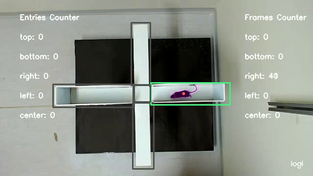

> **Warning**
> This project is currently under construction. Expect frequent changes and updates.

# Mice Tracking Using YOLO

To use the provided tools, the first step is to clone this repository, which can be can be accomplished by:

```console
user@computer:~$ git clone https://github.com/xarmison/proj-pca.git
```

## Requirements

This project's dependencies are managed using [UV](https://docs.astral.sh/uv/). To get started, you need to [install UV](https://docs.astral.sh/uv/) and then create the local environment by running the following commands:

```console
user@computer:~/proj-pca$ uv sync 
user@computer:~/proj-pca$ source .venv/bin/activate
(pymicetracking) user@computer:~/proj-pca$
```

## [Tracker](./src/yolo_tracker.py)



This script aims to track mice throughout a neuroscience experiment detecting when the mice are present in a previously selected region, with that the program is able to keep track of how many frames the animal stayed inside each zone. Usage:

```console
(pymicetracking) user@computer:~/proj-pca$ python src/yolo_tracker.py video experiment_type yolo_model [-h] [--draw-rois] [--save-video] [--log-position] [--log-stats] [--log-speed]
```

**Required arguments**:

* *video*: Path to the video file to be processed.
* *experiment_type*: Type of the experiment being analyzed. Either `OF` or `EPM`.
* *yolo_model*: Path to the YOLO model.

**Optional arguments**:

* *-h, --help*: Show a help message and exit
* *--draw-rois*: User inputed Regions of interest.
* *--save-video*: Create a video file with the analysis result.
* *--log-position*: Logs the position of the center of mass to file.
* *--log-stats*: Logs the statistics of the mice moviment.
* *--log-speed*: Logs the speed of the center of mass to file.

A statistics file containing the following information will be created.

```text
Counters for the regions considering 30fps video

Traveled distance: 16971.568 pixels
top: 3995 frames, 133.167s
bottom: 4105 frames, 136.833s
left: 852 frames, 28.400s
right: 727 frames, 24.233s
center: 1378 frames, 45.933s
```